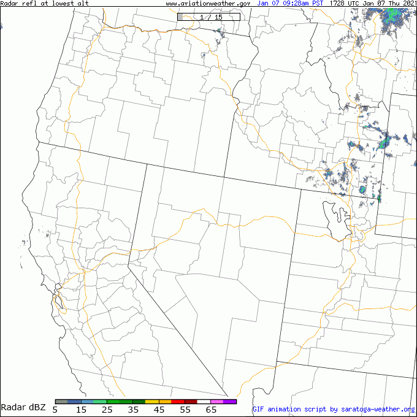

## NWS Regional Radar Animated GIF

This script uses regional radar images from aviationweather.gov/radar/ to create/cache
animated GIF images at 5 minute intervals.

It is invoked by using
```HTML

```
in an HTML page on your website.  If a cache refresh is not needed, then a .gif image is returned by the script.
If a cache refresh is needed, the script will access one HTML page and 15 images from aviationweather.gov/radar/
using HTTPS and cache the resulting animated .gif file.


## Script settings

The following are customizable settings for the _NWS-forecast-map.php_ script:

```php
#--------------------------------------------------------------------------------
# Settings:
#
$NWSregion = 'wmc'; // see below $validRegions entries for valid regions to use
# Note: 2 letter old $NWSregion regions will be translated to 3 letter regions
#
# 'ak', 'hi', 'carib' sites are not displaying data on aviationweather.gov site
#
# Select radar type:
$NWStype = 'rala';  // ='rala' for 'Reference at low altitude'
#                   // ='cref' for 'Composite Reflectivity'
#                   // ='tops-18' for 'Echo Tops - 18dbz'

$refetchSeconds = 300;  // look for new images every 5 minutes (300 seconds)
$cacheFileDir = './cache/'; // directory for cache files

# for Zulu to local times:
$ourTZ = 'America/Los_Angeles'; // Timezone for display
$timeFormat = 'M d h:ia T';  // Jan 05 09:58am PST
#--------------------------------------------------------------------------------

Note that NWS-regional-radar-animate.php DOES NOT access Settings.php in the Saratoga Template (to increase
speed with some Plugin configurations), so as a minimum, you should change
```
$ourTZ = 'America/Los_Angeles'; // Timezone for display
```
to your website's timezone spec (same as used in Settings.php $SITE['tz']) for
proper display of 'local' time on the animated GIF.

Since the aviationweather.gov/radar/ site slices the regional radars a bit differently,
the old $SITE['NWSregion'] designations are now used to select a map close to the old
radar.weather.gov regions.  You may also use the following designations in $SITE['NWSregion']
in case the map displayed is not quite what you had in mind.

For example, the $SITE['NWSregion'] = 'sw' (old designation) actually uses the 'las' (Las Vegas)
view, which doesn't display Central California/Bay Area well, so I prefer using
```
$SITE['NWSregion'] = 'wmc'; (Winnemucca, NV) for my default site.
```
The region-info.pdf file shows the old v.s. new regions offered by aviationweather.gov site.

Here are the new designations available:
```
  'us' => 'Contiguous US|useradar',
  'lws' => 'LWS: Lewiston, ID sector|useradar',
  'wmc' => 'WMC: Winnemucca, NV sector|useradar',
  'las' => 'LAS: Las Vegas, NV sector|useradar',
  'cod' => 'COD: Cody, WY sector|useradar',
  'den' => 'DEN: Denver, CO sector|useradar',
  'abq' => 'ABQ: Albuquerque, NM sector|useradar',
  'pir' => 'PIR: Pierre, SD sector|useradar',
  'ict' => 'ICT: Wichita, KS sector|useradar',
  'aus' => 'AUS: Austin, TX sector|useradar',
  'msp' => 'MSP: Minneapolis, MN sector|useradar',
  'dtw' => 'DTW: Detroit, MI sector|useradar',
  'evv' => 'EVV: Evansville, IN sector|useradar',
  'lit' => 'LIT: Little Rock, AR sector|useradar',
  'alb' => 'ALB: Albany, NY sector|useradar',
  'bwi' => 'BWI: Baltimore, MD sector|useradar',
  'clt' => 'CLT: Charlotte, NC sector|useradar',
  'mgm' => 'MGM: Mongomery, AL sector|useradar',
  'tpa' => 'TPA: Tampa, FL sector|useradar',
```

Note that 'hi' (Hawaii), 'ak' (Alaska) and 'carib' (Caribbean) are supported, BUT the aviationweather.gov site currently returns "Not Available" images for those selections.

## Sample Output


